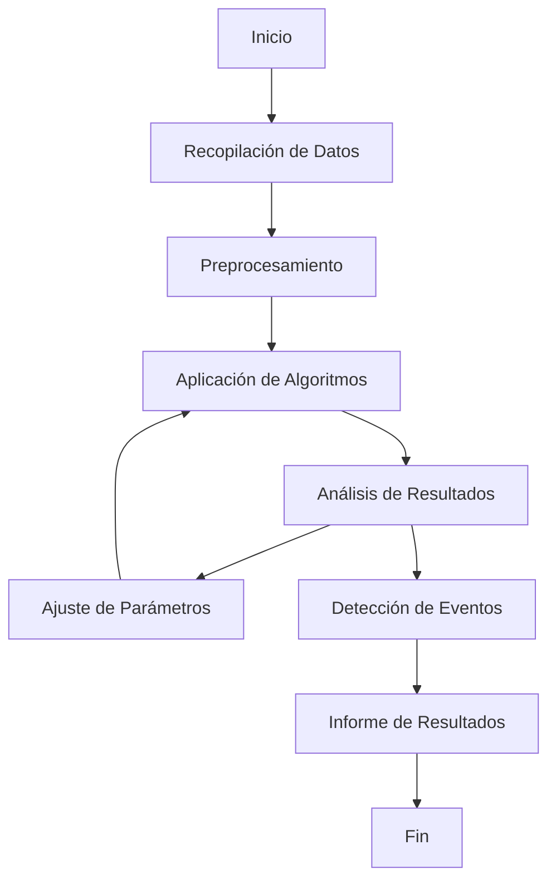
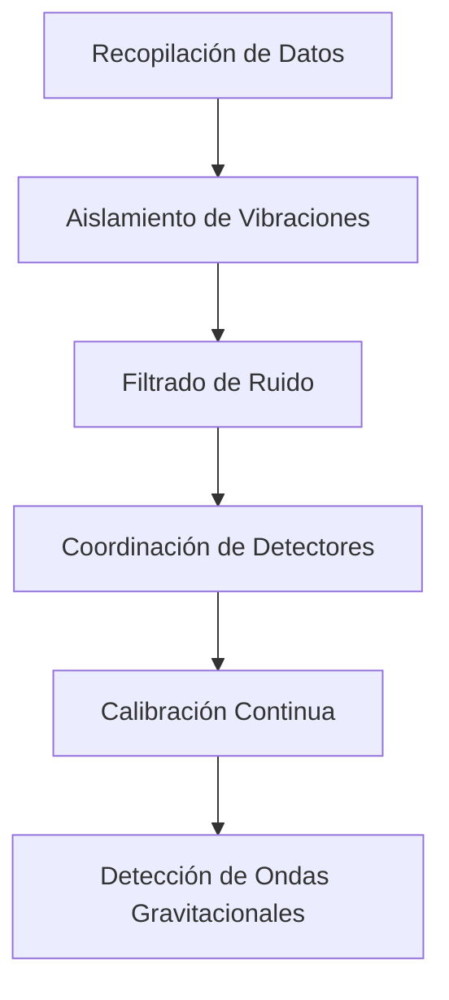
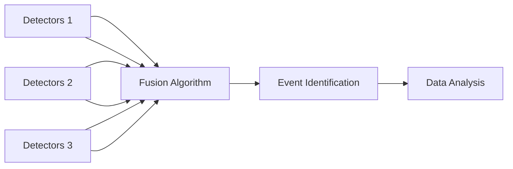
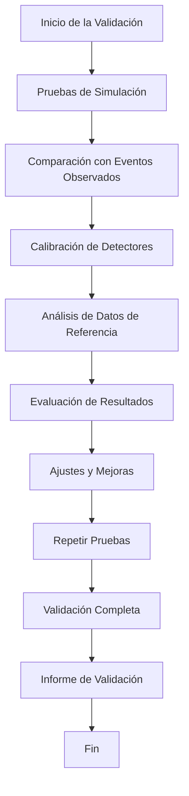
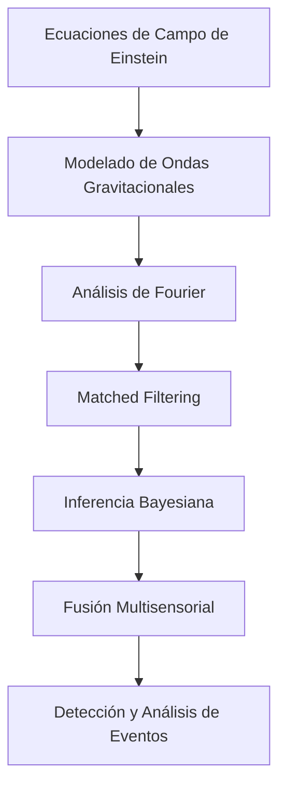
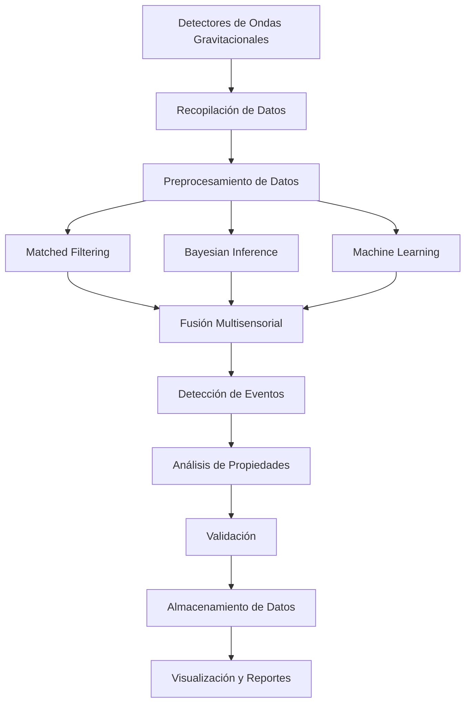
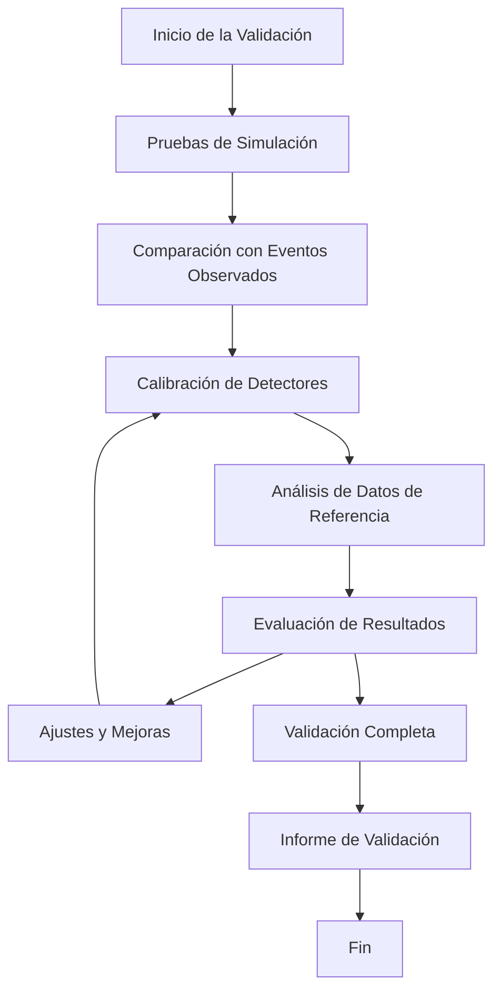

# GAIA-s-HORIZONs
Esta entidad se enfoca en la investigación avanzada, innovación tecnológica, y sostenibilidad, integrando múltiples disciplinas para alcanzar los objetivos de cero impacto ambiental y operaciones avanzadas.

**Entity: GAIA's HORIZONs**


```gitGraph
file:///C:/Users/amate/Downloads/Untitled%20diagram-2025-01-26-143908.svg

    commit id: "Inicialización del Proyecto"
    branch master
    checkout master
    branch SRS
    checkout SRS
    commit id: "Crear System Requirements Specification (SRS)"
    branch SRH
    checkout SRH
    commit id: "Crear System Required Hardware (SRH)"
    checkout SRS
    merge SRH id: "Integrar SRH en SRS"
    
    branch SDD
    checkout SDD
    commit id: "Crear Software Design Document (SDD)"
    checkout SRS
    merge SDD id: "Integrar SDD en SRS"
    
    branch FMEA
    checkout FMEA
    commit id: "Crear Failure Modes and Effects Analysis (FMEA)"
    checkout SRH
    merge FMEA id: "Integrar FMEA en SRH"
    
    branch VTP
    checkout VTP
    commit id: "Crear Validation and Test Plan (VTP)"
    checkout SRS
    merge VTP id: "Integrar VTP en SRS"
    
    branch SEC
    checkout SEC
    commit id: "Crear Cybersecurity Measures (SEC)"
    checkout SRH
    merge SEC id: "Integrar SEC en SRH"
    
    branch TRACE
    checkout TRACE
    commit id: "Crear Traceability Matrix (TRACE)"
    checkout SRS
    merge TRACE id: "Integrar TRACE en SRS"
    
    branch FDR
    checkout FDR
    commit id: "Realizar Final Design Review (FDR)"
    checkout master
    merge SRS id: "Integrar SRS en Master"
    merge SRH id: "Integrar SRH en Master"
    merge FDR id: "Finalizar FDR y Merge en Master"
    
    branch AMM
    checkout AMM
    commit id: "Crear Aircraft Maintenance Manual (AMM)"
    checkout master
    merge AMM id: "Integrar AMM en Master"
    
    branch TSM
    checkout TSM
    commit id: "Crear Troubleshooting Manual (TSM)"
    checkout master
    merge TSM id: "Integrar TSM en Master"
    
    branch APP
    checkout APP
    commit id: "Crear Approval Documentation (APP)"
    checkout master
    merge APP id: "Integrar APP en Master"
```

A continuación se presenta una **versión consolidada** que integra el enfoque del proyecto **GAIA AIR - ZEPHyR** (Zero-Emission Propulsion and Horizon Operations – Research & Development) con la documentación COAFI, los **árboles de componentes**, la estructura S1000D, la referencia a los **documentos de ingeniería** (PDR, SRS, BOM) y los **módulos de datos** (DMC) relevantes.  
Todo se ha redactado en español y siguiendo la metodología de numeración y organización discutida previamente.

---

# **GAIA AIR - ZEPHyR**  
**Zero-Emission Propulsion and Horizon Operations – Research & Development**  

**Objetivo:** Resolver el “problema Voyager” y lograr vuelos con **cero impacto ambiental**, combinando sistemas de propulsión cuántica, recolección energética atmosférica y optimización basada en IA.

---

## **1. Estructura COAFI y “Cosmic Index”**

La **COAFI** (Cosmic Omnidevelopable Aero Foresights Index) es la arquitectura documental que **GAIA AIR - ZEPHyR** emplea para organizar toda la información, desde documentos S1000D hasta datos de ingeniería (PDR, SRS, PBS, BOM). El **“Cosmic Index”** es la interfaz visual que muestra la interrelación de todos estos nodos documentales.

### 1.1 Estructura Principal

1. **Part I: GAIA PULSE ID (GP-ID) — Core Project Identity**  
2. **Part II: GAIA PULSE AIR MODULES (GPAM) — Atmospheric Operations**  
3. **Part III: GAIA PULSE SPACE MODULES (GPSM) — Espacio y Órbita** *(si aplica)*  
4. **Part IV: GAIA PULSE PROPULSION MODULES (GPPM) — Tecnologías de Propulsión**  
5. **Part V: GAIA PULSE GREENTECH & AERO COMMON MODULES (GPGM)**  
   - Ejemplo: \[5.15 ProEnergyGen (QuantumAI), 5.16 FIONDA, 5.17 AirSpecial EcoS\]  
6. **Part VI: GAIA PULSE ADVANCED AI MODULES (GPAI)** *(si aplica)*  
7. … *(Se amplía según necesidades del proyecto)*  

Bajo esta gran estructura, se desglosan los **P/N** (Part Number) e **IN** (Index Number) correspondientes a cada área o capítulo.

---

## **2. GAIA AIR - ZEPHyR: Visión Global**

### 2.1 Descripción General

El proyecto **ZEPHyR** busca desarrollar un ecosistema aeronáutico de **cero emisiones**, combinando:

1. **Q-01 Quantum Propulsion System** (motor cuántico principal del AMPEL360XWLRGA).  
2. **AEHCS** (Atmospheric Energy Harvesting & Conversion System), para captar energía atmosférica.  
3. **FADEC** (Full Authority Digital Engine Control) modificado para propulsión cuántica.  
4. **ML-P** (Machine Learning Paradigm), que proporciona IA avanzada para optimizar en tiempo real.  
5. **ProEnergyGen (QuantumAI)** (Investigación teórica en aprovechamiento de energía cuántica y centros de datos).  

Se incorpora a la **COAFI** con la misión de “resolver el trayecto en aire sin huella ambiental,” integrando módulos de recolección de energía, superconductividad, baterías estructurales y propulsión cuántica.

### 2.2 Árbol de Componentes

A continuación, se presenta una **vista global** de los componentes de ZEPHyR, cada uno con su respectivo número de parte (P/N), la referencia a la sección ATA (si aplica) y a la documentación asociada:

```
ZEPHyR System Tree
└─ GAIA AIR - ZEPHyR (Proyecto Madre)
   ├─ AMPEL360XWLRGA (Aeronave Base)
   │  ├─ P/N: GPAM-AMPEL-0201
   │  ├─ ATA Chapters (05, 06, 07, etc.)
   │  ├─ AEHCS (ATA 28 – modificado)
   │  └─ Secciones estructurales (ATA 51-57…)
   ├─ Q-01 Quantum Propulsion System
   │  ├─ P/N: GPPM-QPROP-0401
   │  ├─ SRS: GPPM-QPROP-0401-SRS-001
   │  ├─ QSM (Quantum State Modulator)
   │  ├─ QEE (Quantum Entanglement Engine)
   │  ├─ Cryogenic System
   │  └─ Documentación (FMEA, PDR, PBS, BOM…)
   ├─ FADEC Integrado
   │  ├─ P/N: GPAM-AMPEL-0201-22 (o 76) (FADEC Docs)
   │  ├─ Interface con Q-01 (IN: GPPM-QPROP-0401-03-001-A)
   │  └─ AI Enhancement (ML-P)
   ├─ AEHCS (Atmospheric Energy Harvesting & Conversion System)
   │  ├─ P/N: GPAM-AMPEL-0201-28
   │  ├─ Módulos: Kinetic Harvesters, Solar, TENG, etc.
   │  └─ Subdocs: PDR, PBS, BOM, S1000D DMC
   ├─ ML-P (Machine Learning Paradigm)
   │  ├─ P/N: GP-ID-MLP-0107
   │  └─ Algoritmos de control, Análisis predictivo, etc.
   └─ ProEnergyGen (QuantumAI) (muy teórico)
      ├─ P/N: GPGM-PGEN-0515
      └─ IN: Whitepapers, Análisis Energía Cuántica
```

---

## **3. Documentación S1000D, Ingeniería y Estructura ATA**

### 3.1 Ejemplo de Árbol Completo (Resumen)

Bajo la **Parte II** (GPAM), se encuentran los capítulos ATA para el AMPEL360XWLRGA (ATA 05, 06, … 71...). Se incluyen **PDR**, **SRS**, **BOM** y **Data Modules (DMC)** según aplique:

1. **ATA 05**: Time Limits / Maintenance Checks  
   - P/N: GPAM-AMPEL-0201-05  
   - IN: Programas de mantenimiento (Scheduled Maintenance Program), etc.  
2. **ATA 06**: Dimensions and Areas  
   - P/N: GPAM-AMPEL-0201-06  
   - IN: Aircraft Dimensions / Compartment Layout  
   - Documentos de Ingeniería: PDR-GAIAPULSE-AMPEL-0201-06-001 (Preliminary Design Review), BOM, PBS…  
3. **ATA 22 o 76**: **FADEC** / Engine Controls  
   - P/N: GPAM-AMPEL-0201-76  
   - IN: GPAM-AMPEL-0201-76-001 → “FADEC Integration with Q-01”  
   - DMC: DMC-GAIAPULSE-AMPEL-0201-76-001-A-001-00_EN-US  
   - PDR, PBS, BOM, etc.  
4. **ATA 28**: AEHCS  
   - P/N: GPAM-AMPEL-0201-28  
   - IN: (varios) Kinetic Energy Harvesters, TENG, Piezo, Eficiencia, etc.  
   - Documentos: GPPM-AEHC-028-XXXX… (caso de uso)  
5. **ATA 71-80**: Motor/Propulsión  
   - Q-01 se documenta en GPPM-QPROP-0401. Sin embargo, la integración a la aeronave se refleja en ATA 71.  
   - Ej.: GPAM-AMPEL-0201-71-01-001 → Montaje e Interfaz de Q-01.  
   - GPPM-QPROP-0401-SRS-001 → SRS del Q-01.  
6. **ATA 91-100**: Test, Certification, etc.

Para cada componente se crean **IN** (Index Number) con sus DMC S1000D asociados y, opcionalmente, un BOM (Bill of Materials), un PDR (Preliminary Design Review) y un PBS (Product Breakdown Structure).

---

## **4. Q-01 Quantum Propulsion System: Resumen**

**P/N:** GPPM-QPROP-0401  
**IN:** GPPM-QPROP-0401-SRS-001-A (SRS)  
**Documentos Clave:**

- `GPPM-QPROP-0401-01-001-A` — **Descripción General del Q-01**  
- `GPPM-QPROP-0401-01-002-A` — **Principios de Operación**  
- `GPPM-QPROP-0401-02-001-A` — **QSM (Quantum State Modulator) Specifications**  
- `GPPM-QPROP-0401-02-002-A` — **QEE (Quantum Entanglement Engine) Design and Operation**  
- `GPPM-QPROP-0401-05-001-A` — **Q-01 FMEA Report**  
- `GPPM-QPROP-0401-06-001-A` — **Manual de Mantenimiento (S1000D)**  
- `GPPM-QPROP-0401-SRS-001` — **Documento de Requisitos del Sistema (SRS)**  

### 4.1 Componentes Principales

1. **Modulador de Estado Cuántico (QSM):**  
   - Genera y modula qubits superconductores bajo campos EM y temperatura criogénica (~20 mK).  
2. **Motor de Entrelazamiento Cuántico (QEE):**  
   - Convierte la energía cuántica manipulada en empuje, interactuando con el vacío cuántico.  
3. **Sistema de Enfriamiento Criogénico:**  
   - Garantiza coherencia cuántica y superconductividad. Integrado con la aeronave y AEHCS.  

### 4.2 Interfaz con FADEC

- **Bus MIL-STD-1553**, latencia ≤ 10 ms (SRS-Q-018).  
- Ajuste de empuje: 100 kN a 1000 kN (SRS-Q-010).  
- Respuesta en tiempo real, datos de telemetría y monitoreo (SRS-Q-019).

### 4.3 Integración con AEHCS

- Recibe energía auxiliar de la **AEHCS** para optimizar el consumo energético.  
- Potencial de almacenamiento en **baterías estructurales** y superconducting grid.

### 4.4 Variables y Parámetros (Ejemplo)

| Variable               | Tipo   | Valor Def. | Descripción                                    | Unidad | Criticidad |
|------------------------|--------|-----------|------------------------------------------------|--------|-----------|
| qsm_temp               | Float  | 0.02      | Temp. del QSM (K)                              | K      | Alta       |
| qsm_entanglement_fid   | Float  | 0.0       | Fidelidad de entrelazamiento (%)               | %      | Alta       |
| qee_energy_conversion  | Float  | 0.75      | Eficiencia de conversión de energía            | %      | Alta       |
| cryo_temp_stability    | Float  | ±5mK      | Margen de estabilidad de temp.                 | mK     | Alta       |
| q01_thrust             | Float  | 0         | Empuje actual del Q-01                         | kN     | Alta       |
| emergency_shutdown     | Bool   | False     | Flag de apagado de emergencia activado (T/F)   | -      | Alta       |

---

## **5. AEHCS: Sistema de Cosecha y Conversión de Energía Atmosférica**

**P/N:** GPAM-AMPEL-0201-28

1. **Módulos de Recolección Energética:**
   - TENG, Piezo, Solar, etc.  
2. **Red Superconductora (HTS):**
   - Distribuye energía con mínimas pérdidas.  
3. **Baterías Estructurales:**
   - Almacenan energía y aportan rigidez estructural.  
4. **Conversión/Regulación (AC/DC, DC/DC):**
   - Adecuación de la energía según requerimientos de Q-01 y otros sistemas.  

---

## **6. FADEC: Introducción y Visión General**

**FADEC** (Full Authority Digital Engine Control)

- Control total del motor cuántico (Q-01).  
- Interfaz con AEHCS y ML-P.  
- Monitoreo y registro de datos de performance, fault detection y mantenimiento predictivo.  

**Documentos relacionados:**

- GPAM-AMPEL-0201-76-001 — FADEC System Description  
- GPPM-QPROP-0401-03-001-A — Q-01 <-> FADEC Communication Protocol  
- PDR-FADEC-XXXX-XXX, PBS, BOM…

---

## **7. ML-P: Machine Learning Paradigm**

Implementación IA dentro del proyecto ZEPHyR:

- **Control Predictivo**: Ajuste dinámico de Q-01 según condiciones de vuelo.  
- **Mantenimiento Predictivo**: Análisis de datos de vibraciones, coherencia cuántica, etc.  
- **Optimización Energética**: Sinergia AEHCS-Q-01.  
- **Arquitectura**: IA explicable (SRS-Q-022).  

---

## **8. Documentos de Ingeniería (PDR, SRS, PBS, BOM) — Ejemplo Integrado**

Para cada componente/sistema, se generan documentos:

1. **SRS** (System Requirements Specification):
   - Ej.: `GPPM-QPROP-0401-SRS-001` (Q-01).  
2. **PDR** (Preliminary Design Review):
   - Ej.: `PDR-GAIAPULSE-AMPEL-0201-06-001` (Dimensiones del AMPEL360XWLRGA).  
3. **PBS** (Product Breakdown Structure):
   - Ej.: `PBS-GAIAPULSE-AMPEL-0201-06-001`.  
4. **BOM** (Bill of Materials):
   - Ej.: `BOM-GAIAPULSE-AMPEL-0201-06-001`.  
5. **DMC** (S1000D Data Modules):
   - Ej.: `DMC-GAIAPULSE-AMPEL-0201-28-001-A-001-00_EN-US` (AEHCS Kinetic Harvester).  

Todos estos se documentan bajo la *COAFI* y se indexan en el **“Cosmic Index”** con sus conexiones.

---

## **9. Sostenibilidad y Futuro**

1. **Cero Emisiones:**  
   - El Q-01 no requiere combustibles fósiles, y AEHCS reduce aún más la dependencia energética externa.  
2. **Materiales y Reciclabilidad:**  
   - Uso de CFRP, Al-Li, compuestos reciclables.  
3. **Investigación Continua:**  
   - **ProEnergyGen** (QuantumAI) estudia la posible generación de energía desde centros de datos cuánticos.  
   - Líneas especulativas como **GWA** (Amplificador de Ondas Gravitacionales) se catalogan como “Investigación Básica.”  

---

## **10. Conclusión**

**GAIA AIR - ZEPHyR** constituye una **plataforma aeronáutica integral** que busca la **propulsión cuántica** (Q-01), la recolección de energía atmosférica (AEHCS), el control basado en IA (ML-P) y la gestión documental y de diseño a través del **COAFI** y el **“Cosmic Index.”**

- Se logra un **árbol documental** completo, con P/N, IN, DMC y documentos de ingeniería (PDR, SRS, BOM).  
- El **FADEC** modificado se encarga de controlar en tiempo real el motor cuántico, integrándose con la aeronave AMPEL360XWLRGA.  
- La **sostenibilidad** y la reducción a **cero** de emisiones contaminantes son las metas principales.  

**Pasos siguientes:**  
1. **Desarrollo de prototipos y validación**: Realizar pruebas de integración Q-01 + AEHCS + FADEC en bancada y en túnel de viento.  
2. **Actualización y Refinamiento**: Completar los capítulos ATA pendientes, añadir más S1000D DMC detallados, generar planes de certificación.  
3. **Integración en “Cosmic Index”**: Asegurar el mapeo de cada documento y módulo.  
4. **Escalabilidad**: Analizar la posibilidad de aplicar la tecnología ZEPHyR a otras aeronaves y, en un futuro, a operaciones espaciales.

---

## **Diagrama de Componentes (Mermaid ejemplar)**

```mermaid
graph LR
    subgraph GAIA AIR - ZEPHyR Ecosystem
    A(Q-01 Quantum Propulsion)
    B(AEHCS)
    C(FADEC)
    D(ML-P)
    E(AMPEL360XWLRGA)
    end

    A -- "Primary Thrust" --> E
    B -- "Energy Support" --> A
    C -- "Control & Monitoring" --> A
    D -- "AI Optimization" --> [FADEC/AEHCS/Q-01]
    E -- "Aircraft Integration" --> A & B

    style A fill:#fffcb2,stroke:#bba,stroke-width:1px
    style B fill:#b2ffc5,stroke:#bbf,stroke-width:1px
    style C fill:#b2d6ff,stroke:#bdf,stroke-width:1px
    style D fill:#f9f,stroke:#fcc,stroke-width:1px
    style E fill:#ccc,stroke:#999,stroke-width:1px
```

---

### **Contacto / Créditos**

- **Autor(es):**  
  - A. Pelliccia & AI Collaboration  
  - Equipo GAIA AIR - ZEPHyR

- **Referencias Principales:**  
  - GPPM-QPROP-0401-SRS-001 (Requisitos del Q-01)  
  - GPAM-AMPEL-0201-28 (AEHCS)  
  - GPAM-AMPEL-0201-76 (FADEC/Engine Controls)  
  - GPGM-PGEN-0515 (ProEnergyGen)  
  - COAFI Document Tree (Part I-V)  

---

Con esta **descripción final**, se cumple el objetivo de **mostrar el árbol completo** (incluyendo relaciones entre documentos de ingeniería y módulos S1000D), la **estructura** ATA/S1000D correspondiente, y un **diagrama de componentes** que ilustra cómo se integran **Q-01**, **AEHCS**, **FADEC** y **ML-P** dentro del proyecto **GAIA AIR - ZEPHyR** para lograr vuelos de **cero impacto ambiental**. 

Si requieres **más detalles** en alguna sección (p.ej. algoritmos de IA, materiales, FMEA completo del Q-01 o la integración ProEnergyGen), o **nuevos diagramas** (p.ej. PERT, Gantt, PBS detallado), ¡no dudes en indicarlo!

---

# **GAIA's HORIZONs**

## **1. Introducción**

**GAIA's HORIZONs** es una **entidad estratégica** dentro del ecosistema GAIA AIR - ZEPHyR, diseñada para expandir los horizontes tecnológicos y operacionales de la organización. Esta entidad se enfoca en la **investigación avanzada**, **innovación tecnológica**, y **sostenibilidad**, integrando múltiples disciplinas para alcanzar los objetivos de **cero impacto ambiental** y **operaciones avanzadas**.

---

## **2. Misión y Visión**

### **Misión**

Desarrollar y aplicar tecnologías avanzadas que impulsen la sostenibilidad y la eficiencia en la aviación y otros sectores relacionados, asegurando un impacto ambiental mínimo y promoviendo la innovación ética y responsable.

### **Visión**

Ser líder en la creación de soluciones aeroespaciales innovadoras y sostenibles, utilizando la intersección de la **propulsión cuántica**, la **recolección de energía atmosférica**, y la **inteligencia artificial** para redefinir el futuro de la aviación y las operaciones espaciales.

---

## **3. Objetivos Clave**

1. **Innovación Tecnológica:**  
   Desarrollar tecnologías pioneras en propulsión cuántica, recolección de energía, y optimización mediante IA para lograr vuelos de **cero emisiones**.

2. **Sostenibilidad:**  
   Implementar soluciones que reduzcan significativamente la huella ambiental de las operaciones aeronáuticas y energéticas.

3. **Integración Multidisciplinaria:**  
   Fomentar la colaboración entre diferentes disciplinas como la física cuántica, la ingeniería aeroespacial, y la ciencia de datos para crear soluciones integrales.

4. **Ética y Responsabilidad:**  
   Asegurar que todas las innovaciones se desarrollen y apliquen de manera ética, promoviendo el bienestar global y respetando los principios de "Ethics by Design."

---

## **4. Divisiones Principales**

### 4.1 **GAIA AIR – Sistemas Aeronáuticos Avanzados**

- **Proyectos Principales:**
  - **ZEPHyR (Zero-Emission Propulsion and Horizon Operations – R&D):** Desarrollo de sistemas de propulsión cuántica y recolección de energía atmosférica para aeronaves.
  
- **Subdivisiones:**
  - **AEHCS (Atmospheric Energy Harvesting & Conversion System):** Focalizado en la integración de fuentes de energía renovable en la aviación.
  - **Q-01 Quantum Propulsion System:** Sistema de propulsión revolucionario basado en la manipulación de estados cuánticos.

### 4.2 **GAIA SPACE – Expansión Más Allá de la Tierra**

- **Enfoque:**  
  Sistemas de propulsión avanzados, satélites, y sostenibilidad orbital.
  
- **Proyectos Destacados:**
  - **CVTs (Cápsulas VTOL Teledirigidas):** Plataformas VTOL versátiles para operaciones de alta altitud y misiones orbitales.

### 4.3 **GAIA PULSE GREENTECH – Sostenibilidad y Medio Ambiente**

- **Sistemas Clave:**
  - **ProEnergyGen (QuantumAI):** Investigación teórica sobre generación de energía a partir de centros de datos cuánticos.
  - **AirSpecial EcoS:** Sistemas avanzados de monitoreo ambiental y atmosférico.

### 4.4 **GAIA INTELLIGENCE – Datos, IA e Integración de Sistemas**

- **Frameworks:**
  - **ML-P (Machine Learning Paradigm):** Marco de IA para optimización y análisis predictivo.
  - **Digital Twin Systems:** Réplicas virtuales de alta fidelidad para monitoreo y simulación en tiempo real.

### 4.5 **GAIA MATERIALS – Compuestos y Aleaciones Avanzadas**

- **Enfoque:**  
  Desarrollo de materiales de próxima generación como **CFRP**, **aleaciones de aluminio-litio (Al-Li)** y **polímeros inteligentes** para construcción sostenible.

---

## **5. Proyectos Emblemáticos**

### 5.1 **GAIA AIR - ZEPHyR**

- **Objetivo:**  
  Habilitar la aviación con emisiones cero mediante propulsión cuántica y recolección de energía atmosférica.

- **Tecnologías Centrales:**  
  - Q-01 Quantum Propulsion System.  
  - AEHCS (Recolección de energía de fuentes cinéticas y solares).  
  - Sistemas FADEC basados en IA.

### 5.2 **FIONDA**

- **Objetivo:**  
  Investigación en redes oscilatorias para transferencia de energía y propulsión.

### 5.3 **ProEnergyGen (QuantumAI)**

- **Objetivo:**  
  Teorizar y desarrollar centros de datos cuánticos capaces de generación de energía a través de interacciones cuánticas avanzadas.

### 5.4 **HORIZON - Roadmap de Sostenibilidad**

- **Iniciativa transversal:**  
  Focalizada en alcanzar **neutralidad de carbono**, eficiencia energética, y soluciones ecológicas escalables.

---

## **6. Integración con el Cosmic Index**

**GAIA's HORIZONs** está estructurado dentro del **"Cosmic Index"**, proporcionando un sistema de datos jerárquico e interconectado. Características clave:

- **Nodos Dinámicos:**  
  Cada proyecto o división cuenta con nodos dedicados que enlazan documentos, detalles técnicos y módulos de datos.

- **Actualizaciones en Tiempo Real:**  
  Seguimiento en vivo del progreso a través de datos provenientes del Digital Twin.

- **Marco de Colaboración:**  
  Facilita la interoperabilidad entre divisiones como **GAIA AIR**, **GAIA SPACE**, y **GAIA GREENTECH**.

---

## **7. Direcciones Futuras**

1. **Operaciones Interplanetarias:**  
   Explorar la escalabilidad de la propulsión cuántica para misiones interplanetarias y aplicaciones de **ProEnergyGen** en hábitats espaciales.

2. **Gobernanza Avanzada de IA:**  
   Desarrollar un **Sistema de Gobernanza Híbrido Humano-Máquina (HMHGS)** para asegurar la integración ética de la IA en procesos de toma de decisiones.

3. **Metas de Sostenibilidad Global:**  
   Colaborar con organismos internacionales para alinear las innovaciones de GAIA con **objetivos climáticos globales** y marcos de energía renovable.

---

## **8. Conclusión**

**GAIA's HORIZONs** representa la **cúspide de la innovación**, combinando sostenibilidad, tecnología avanzada y responsabilidad ética. Al empujar los límites de lo posible, busca redefinir el futuro de la aviación, la energía y las operaciones planetarias.

---

### **Contacto / Créditos**

- **Autor(es):**  
  - A. Pelliccia & AI Collaboration  
  - Equipo GAIA AIR - ZEPHyR  
  - Equipo GAIA's HORIZONs

- **Referencias Principales:**  
  - GPPM-QPROP-0401-SRS-001 (Requisitos del Q-01)  
  - GPAM-AMPEL-0201-28 (AEHCS)  
  - GPAM-AMPEL-0201-76 (FADEC/Engine Controls)  
  - GPGM-PGEN-0515 (ProEnergyGen)  
  - COAFI Document Tree (Part I-V)  

---

A continuación se presenta una **versión consolidada y detallada** que integra las descripciones y requisitos previos de **Q-01** (Quantum Propulsion System) con el enfoque en **propulsión cuántica** dentro del proyecto **AMPEL360XWLRGA (GAIA AIR)**, destacando las características principales, su interacción con AEHCS y el impacto en sostenibilidad y futuro desarrollo.

---

# **Q-01 Quantum Propulsion System: Visión Integrada**

**P/N:** GPPM-QPROP-0401-SRS-001  
**IN:** GPPM-QPROP-0401-SRS-001-A  
**Versión:** 1.0  
**Fecha:** 2025-01-22  
**Autor(es):** Amedeo Pelliccia & AI Collaboration  
**Estado:** Borrador

---

## 1. Introducción

Este documento define la Especificación de Requisitos del Sistema (**SRS**) para el **Q-01 Quantum Propulsion System**, que sirve como unidad de propulsión principal para el AMPEL360XWLRGA en el marco del proyecto **GAIA AIR**. El Q-01 representa una aproximación revolucionaria a la propulsión aeronáutica, basada en la manipulación de estados cuánticos, el entrelazamiento y la integración sinérgica con sistemas de energía avanzada como el **AEHCS**.

---

## 2. Descripción General del Q-01

1. **Propulsión Cuántica Más Allá de lo Convencional**  
   - El **Q-01** se basa en principios de física cuántica, superando las limitaciones de motores de combustión tradicional.  
   - Emplea estados cuánticos y fenómenos de entrelazamiento para generar empuje **sin combustibles fósiles** ni emisiones contaminantes directas.

2. **Componentes Principales**  
   - **Modulador de Estado Cuántico (QSM):** Control de qubits superconductores y campos electromagnéticos criogénicos.  
   - **Motor de Entrelazamiento Cuántico (QEE):** Convierte la energía de estados cuánticos en empuje, interactuando con el vacío cuántico y produciendo distorsiones espaciotemporales localizadas.  
   - **Sistema de Enfriamiento Criogénico:** Mantiene la coherencia cuántica y la superconductividad cercana al cero absoluto.

3. **Interacción con AEHCS**  
   - El Q-01 se integra con el **Atmospheric Energy Harvesting & Conversion System (AEHCS)**, para recibir energía auxiliar y optimizar la eficiencia total de la propulsión.  
   - Reduce la dependencia de fuentes externas y aprovecha la energía atmosférica para sostener los procesos cuánticos.

---

## 3. Requisitos Generales (Resumen)

- **SRS-Q-001:** Proveer la propulsión principal del AMPEL360XWLRGA.  
- **SRS-Q-002:** Utilizar mecánica cuántica (estados de entrelazamiento, modulación de qubits) para generar empuje.  
- **SRS-Q-003:** Integración con AEHCS para obtener energía auxiliar.  
- **SRS-Q-004:** Cumplir con normas de seguridad/certificación (FAR Part 25 / CS-25, guías emergentes en propulsión cuántica).  
- **SRS-Q-005:** Vida útil mínima de 20.000 horas de vuelo.  
- **SRS-Q-006:** Diseño modular para facilitar mantenimiento y reemplazo de componentes.  
- **SRS-Q-007:** “Kill switch” manual/automático (según doc GPPM-QPROP-0401-05-003-A).  
- **SRS-Q-008:** Diseño redundante y seguro para QSM, QEE y criogenia.

---

## 4. Requisitos Funcionales

- **SRS-Q-010:** Rango de empuje: 100 kN (mín.) a 1000 kN (máx.), ajustable vía FADEC.  
- **SRS-Q-011:** Relación empuje/peso ≥ 10:1.  
- **SRS-Q-012:** Eficiencia global de conversión de energía ≥ 75%.  
- **SRS-Q-013:** Fidelidad del QSM ≥ 99,9% para mantener coherencia cuántica.  
- **SRS-Q-014:** Tiempo de coherencia en QSM ≥ 1 segundo.  
- **SRS-Q-015:** QEE con eficiencia de conversión cuántica a empuje ≥ 40%.  
- **SRS-Q-016:** Criogenia estable a 20 mK (± 5 mK).  
- **SRS-Q-017:** Secuencias seguras de arranque/parada.  
- **SRS-Q-018:** Latencia de respuesta en FADEC ≤ 10 ms.  
- **SRS-Q-019:** Telemetría de todos los componentes (rendimiento, alertas, fallas).  
- **SRS-Q-020:** Interfaz AEHCS para captar energía auxiliar.  
- **SRS-Q-021:** IA (ML-P) para detección de anomalías en tiempo real y mantenimiento predictivo.  
- **SRS-Q-022:** Algoritmos de control explicables y certificables.

---

## 5. Integración en el AMPEL360XWLRGA

1. **Ubicación:**  
   - El Q-01 se monta en el cono de cola del AMPEL360XWLRGA, con refuerzos estructurales, sistemas de gestión térmica y blindaje electromagnético.
2. **Interfaz con FADEC:**  
   - Conexión a través de bus MIL-STD-1553, permitiendo un control preciso de empuje y maniobrabilidad en todo el sobre de vuelo.  
3. **Beneficios Clave:**  
   - **Mayor eficiencia de propulsión:** Reducción notable de consumo energético en comparación con motores convencionales.  
   - **Operación silenciosa:** Ausencia de combustión y turbinas tradicionales reduce la contaminación acústica.  
   - **Capacidad de vuelo a gran altitud:** Permite aprovechar la recolección de energía atmosférica por AEHCS y el bajo arrastre aerodinámico.

---

## 6. Rendimiento y Sostenibilidad

1. **Reducción de Emisiones**  
   - Al utilizar fenómenos cuánticos y no combustibles fósiles, el Q-01 reduce la huella de carbono y emisiones contaminantes.  
2. **Eficiencia Energética**  
   - Integración AEHCS–Q-01 maximiza la autosuficiencia energética, minimizando combustibles externos.  
3. **Materiales Avanzados**  
   - Uso de composites (CFRP), aleaciones Al-Li y polímeros inteligentes que optimizan peso y durabilidad, reforzando la sostenibilidad del ciclo de vida.  
4. **Contribución al Proyecto GAIA AIR**  
   - Q-01 refuerza la visión de GAIA AIR en aviación limpia, silenciosa y de alto rendimiento, impulsando la revolución de la propulsión cuántica.

---

## 7. Diseño y Operación

1. **Diseño del Cono de Cola**  
   - Ajustes geométricos, refuerzo estructural, blindaje EM y gestión térmica para acomodar el Q-01.  
2. **Materiales Avanzados**  
   - Compósitos de fibra de carbono y aleaciones ligeras con alta resistencia a vibraciones y temperaturas extremas.  
3. **Simulación y Validación**  
   - Uso de CFD (simulación multifísica) y FEA para confirmar estabilidad estructural, disipación térmica y rendimiento aerodinámico.  
4. **Enfriamiento Criogénico**  
   - Sistema de refrigeración cerca del cero absoluto para mantener la coherencia cuántica en el QSM y la superconductividad en el QEE.

---

## 8. Innovación y Futuro

1. **Avance Tecnológico**  
   - El Q-01 representa un paso disruptivo, integrando IA, criogenia y física cuántica en propulsión.  
2. **Colaboración Multidisciplinaria**  
   - La colaboración entre físicos cuánticos, ingenieros aeroespaciales y expertos en materiales es esencial para refinar y escalar esta tecnología.  
3. **Potencial de Descubrimientos**  
   - Más allá de la aviación, la investigación en propulsión cuántica podría originar nuevos descubrimientos fundamentales en mecánica cuántica, energía del vacío y entrelazamiento.  

---

## 9. Consideraciones de Seguridad y Ética

1. **IA Transparente:**  
   - El control del Q-01 debe ser auditable, explicable y cumplir lineamientos éticos en IA.  
2. **Seguridad Operativa:**  
   - Protocolos estrictos de arranque/parada, redundancias, FMEA completo y robusto blindaje contra campos EM/cuánticos.  
3. **Prevención de Uso Indebido:**  
   - Directrices claras para un uso responsable de la tecnología cuántica, evitando aplicaciones peligrosas o no éticas.

---

## 10. Mantenimiento y Documentación

- **SRS-Q-060 a SRS-Q-063**:  
  - Diseño accesible para mantenimiento (puede efectuarse con robótica GAR-C).  
  - Documentación completa según S1000D, con manuales y planes de mantenimiento (p.ej., GPPM-QPROP-0401-06-001-A).  
- **Actualizaciones de Software/IA:**  
  - Los módulos de IA y control del Q-01 deben poder actualizarse para mejorar la eficiencia y corregir vulnerabilidades.

---

## 11. Próximos Pasos (Roadmap)

1. **Investigación y Desarrollo:**  
   - Enfoque en optimizar la estabilidad de estados cuánticos, miniaturizar componentes y perfeccionar la eficiencia de conversión.  
2. **Pruebas Avanzadas:**  
   - Validar el rendimiento y la seguridad del Q-01 en entornos controlados (bancos de prueba, túneles de viento, y luego prototipos de vuelo).  
3. **Colaboración Abierta:**  
   - Fomentar alianzas con laboratorios de investigación cuántica, universidades y proveedores de tecnología aeroespacial avanzada.

---

## 12. Conclusión

El **Q-01** se perfila como el sistema de propulsión cuántica central del **AMPEL360XWLRGA**, integrándose con el **AEHCS** y alineado con la visión ecológica y futurista del **Proyecto GAIA AIR**. Gracias a sus capacidades de entrelazamiento cuántico y su eficiencia teórica superior, este sistema **marca un hito** en el desarrollo de la aviación sostenible y silenciosa. No obstante, su éxito depende de la continuada **investigación interdisciplinaria**, la resolución de desafíos criogénicos y cuánticos, y la consolidación de protocolos de seguridad y certificación que **aún están en sus inicios**.

---

# Anexo: Información Complementaria

### 1. Referencias / Documentos Relacionados
- **GPPM-QPROP-0401-05-001-A:** Q-01 FMEA Report  
- **GPPM-QPROP-0401-05-003-A:** Q-01 Emergency Shutdown System Design  
- **GPPM-QPROP-0401-06-001-A:** Q-01 Maintenance Manual (S1000D)  
- **GPPM-QPROP-0401-02-002-A:** QEE Design and Operation  
- **GPPM-QPROP-0401-02-001-A:** QSM Specifications  

### 2. Glosario
- **QSM (Quantum State Modulator)**
- **QEE (Quantum Entanglement Engine)**
- **AEHCS (Atmospheric Energy Harvesting & Conversion System)**
- **FADEC (Full Authority Digital Engine Control)**
- **ML-P (Machine Learning Paradigm)**

### 3. Notas Finales
- El desarrollo y la integración del Q-01 suponen un **desafío sin precedentes** para la aviación.  
- Se recomienda un enfoque iterativo en I+D, testeando versiones incrementales del Q-01 antes de su implementación definitiva en los prototipos AMPEL360XWLRGA.  
- Cualquier cambio en los parámetros fundamentales (por ej., potencia criogénica, eficiencia cuántica) debe revisarse en conjunto con las otras secciones COAFI para asegurar **consistencia y trazabilidad** documental.

---

Below is a **final conceptual assessment** that consolidates the **Q-01 Quantum Propulsion System** and the **ProEnergyGen (QuantumAI)** concept, along with the **Gravitational Wave Amplifier (GWA)** and **Exotic Matter** discussions. It provides a coherent overview of each element, highlights the feasibility matrix for exotic matter, and recommends a **balanced approach** to future R&D efforts under the **GAIA AIR** project umbrella.

---

# 1. Q-01 Quantum Propulsion System: Summary

## 1.1 Purpose

- **Q-01** is the primary propulsion unit for the **AMPEL360XWLRGA** under the **GAIA AIR** project, leveraging quantum mechanics (quantum entanglement, quantum state manipulation) to generate thrust.

## 1.2 Requirements Overview

1. **Thrust Range & Efficiency**  
   - **100 kN to 1000 kN** adjustable thrust via FADEC  
   - Overall energy conversion efficiency ≥ 75%  
2. **Quantum State Modulator (QSM)** Fidelity ≥ 99.9%  
   - Coherence Time ≥ 1 second  
3. **Quantum Entanglement Engine (QEE)** Efficiency ≥ 40%  
4. **Cryogenic System**  
   - Temperature stability at **20 mK (±5 mK)**  
5. **Safety & Maintenance**  
   - Redundant design, immediate kill switch, full FMEA, accessible for repairs (S1000D documentation)

## 1.3 Relevance & Next Steps

- **Q-01** stands as GAIA AIR’s leading quantum-based propulsion technology.  
- Its integration with the **Atmospheric Energy Harvesting & Conversion System (AEHCS)** offers synergy for auxiliary power.  
- Validation phases involve simulation, test flights, and compliance with emerging quantum propulsion guidelines.

---

# 2. ProEnergyGen (QuantumAI): Quantum Data Centers as Power Plants

## 2.1 Concept

- **ProEnergyGen** envisions specialized **quantum computing data centers** that not only perform computation but also generate power—via highly speculative quantum effects—possibly supporting aircraft propulsion, ground infrastructure, or space systems.

## 2.2 Core Pillars

1. **Quantum Computing as Energy Source**  
   - Exploring quantum phenomena (zero-point energy, quantum fluctuations) for energy generation.  
   - Currently theoretical, lacks mainstream experimental validation.

2. **Hybrid Quantum-Classical Architecture**  
   - Integrates classical HPC clusters with quantum processors.  
   - AI (ML-P) orchestrates dynamic resource allocation, data traffic, and potential “energy byproducts.”

3. **Energy Storage & Distribution**  
   - High-capacity storage (e.g., structural batteries, superconducting lines).  
   - Potential link to Q-01 or AEHCS for in-flight or ground-based power transfer.

4. **AI-Driven Optimization**  
   - Intelligent scheduling of computations that might yield minimal net energy overhead or a hypothetical surplus.  
   - Automated anomaly detection for stability in cryogenic and quantum systems.

## 2.3 Potential Applications

1. **Ground Infrastructure Power**:  Fueling vertiports, manufacturing sites, or robotic units (ROBBBO-T).  
2. **Supplemental Power for Q-01**:  Extending range or reducing main system load.  
3. **Space Operations**:  Possibly powering modules in orbit, if scaled successfully.

## 2.4 Key Challenges

- **Theoretical Foundations**: No established mechanism to reliably convert quantum computational processes into net usable energy.  
- **Technology Gaps**: Maintaining large-scale quantum computers with integrated power generation is beyond current capabilities.  
- **Cryogenic Demands**: Meeting the extreme cooling needs while still aiming for energy positivity is highly non-trivial.

---

# 3. Gravitational Wave Amplifier (GWA): Ultra-Advanced Sub-Concept

## 3.1 Overview

- A **Gravitational Wave Amplifier** would, in principle, attempt to interact with and amplify gravitational waves (GWs) for energy extraction or advanced propulsion.  
- This is **highly speculative**, lacking any direct experimental backing.  
- Conceptually, one might envision resonant cavities or exotic matter that resonates with incoming GWs.

## 3.2 Alignment with ProEnergyGen

- *If* such a GWA existed, it could integrate with ProEnergyGen’s quantum data center—using advanced quantum sensors and negative energy states (exotic matter) to manipulate gravitational waves.  
- Currently, there is **no known** theoretical or experimental basis for net amplification or harnessing of GW energy.

## 3.3 Major Obstacles

1. **Extreme Weak Coupling**: Gravitational waves barely interact with normal matter.  
2. **Energy Condition Violations**: Amplifying or reflecting GWs might require negative mass/energy densities—deeply theoretical and unobserved.  
3. **Zero Experiments**: None suggest a path to resonant cavities that yield net energy from GWs.

---

# 4. Exotic Matter: Feasibility Matrix

**Exotic matter** (negative mass or large negative energy densities) is often cited in far-future propulsion or gravitational wave amplifier concepts. However, **feasibility** remains extremely low under present physics. The matrix below recaps the major points:

| **Exotic Parameter**                        | **Feasibility** | **Key Challenges**                                                                   | **Potential Impact**                                                    |
|--------------------------------------------|-----------------|--------------------------------------------------------------------------------------|-------------------------------------------------------------------------|
| Negative Mass Density                      | Very Low        | Violates energy conditions; no evidence; needs new physics                          | Warp-like drives, wormholes, advanced gravitational wave manipulation  |
| Sustained Negative Energy (Macroscopic)    | Very Low        | Typically ephemeral/localized (Casimir effect); huge theoretical obstacles          | Could allow stable wormholes, advanced propulsion structures           |
| High GW Coupling                           | Very Low–Low    | Standard matter barely couples; requires hypothetical enhanced coupling constants   | Amplifying or redirecting gravitational waves                          |
| Macroscopic Quantum Stability              | Very Low        | Decoherence dominates at scale; near-zero-K needed                                   | If stable, might keep negative energy lumps or advanced quantum states |
| Controllability of Negative Mass/Energy    | Very Low        | No known method for real-time modulation on macroscale                               | Real-time “warp field” generation, gravitational wave resonance        |
| Minimizing Energy-Condition Violations     | Very Low–Low    | Quantum inequalities limit negativity; ephemeral solutions                          | Potentially safer exotic matter configurations                          |
| Scalable Production / Harvesting           | Extremely Low   | No known natural or lab processes to produce negative mass                          | Could revolutionize resource usage for advanced flight/space           |
| Safe Containment & Storage                | Very Low        | Negative mass containment or localized negative energy—no existing methodology      | Lab tests or in-flight usage remain purely hypothetical                |

Overall conclusion: **Exotic matter** remains a purely speculative domain with potentially revolutionary but nearly impossible near-term applications.

---

# Gravitational Wave Processing System

## Table of Contents

1. [Introduction](#introduction)
2. [Gravitational Wave Polarization](#gravitational-wave-polarization)
3. [Algorithmic Iterations](#algorithmic-iterations)
4. [Interference Mitigation](#interference-mitigation)
5. [Multisensor Fusion](#multisensor-fusion)
6. [Validation](#validation)
7. [Mathematical Foundations](#mathematical-foundations)
8. [Code Examples](#code-examples)
9. [Diagrams](#diagrams)
10. [Referencias](#referencias)
11. [Contributing](#contributing)
12. [License](#license)

---

## 1. Introduction

### **Overview**

El **Sistema de Procesamiento de Ondas Gravitacionales** es una tecnología avanzada diseñada para detectar, analizar y procesar ondas gravitacionales generadas por fenómenos astronómicos como la colisión de agujeros negros, estrellas de neutrones y supernovas. Estas ondas, predichas por la teoría de la relatividad general de Einstein, proporcionan información invaluable sobre el universo, permitiendo a los científicos estudiar eventos cósmicos que no son observables a través de otros medios electromagnéticos.

### **Importancia**

La detección y procesamiento de ondas gravitacionales abren una nueva ventana en la astronomía, permitiendo la observación directa de eventos masivos y violentos en el cosmos. Este sistema no solo mejora nuestra comprensión del universo, sino que también impulsa el desarrollo de tecnologías de detección de alta precisión y algoritmos avanzados de análisis de datos.

### **Objetivos del Documento**

- Describir los fundamentos y componentes clave del Sistema de Procesamiento de Ondas Gravitacionales.
- Explorar las técnicas de polarización de ondas gravitacionales y su importancia.
- Detallar los algoritmos utilizados para iteraciones y procesamiento de datos.
- Presentar estrategias para la mitigación de interferencias y mejora de la señal.
- Explicar la fusión multisensorial para aumentar la precisión y confiabilidad de las detecciones.
- Proporcionar métodos de validación para asegurar la integridad y precisión del sistema.
- Desarrollar las bases matemáticas que sustentan el procesamiento de ondas gravitacionales.
- Incluir ejemplos de código para ilustrar la implementación de algoritmos.
- Integrar diagramas que visualicen el flujo de datos y la arquitectura del sistema.

### **Clarificación Conceptual: Movimiento de Cuerpos y Generación de Ondas Gravitacionales**

Es fundamental entender que las ondas gravitacionales no son simplemente el resultado de la presencia de un cuerpo en el espacio-tiempo, sino que su generación está intrínsecamente ligada al movimiento de dicho cuerpo. De manera similar a cómo una onda de impacto (onda d'urgoto) se propaga en un medio debido a la fuerza y el movimiento de un objeto, las ondas gravitacionales son perturbaciones en el tejido del espacio-tiempo causadas por la aceleración y el movimiento dinámico de masas extremadamente grandes.

Esta analogía resalta que no es la mera existencia de un cuerpo lo que dinamiza el espacio-tiempo, sino su comportamiento dinámico. Así, eventos como la fusión de agujeros negros o estrellas de neutrones generan ondas gravitacionales significativas debido a los movimientos rápidos y violentos de estas masas, creando ondas que se propagan a través del espacio-tiempo con características específicas de polarización y frecuencia.

---

## 2. Gravitational Wave Polarization

### **Descripción General**

Las ondas gravitacionales poseen propiedades de polarización que son fundamentales para su detección y análisis. La polarización describe la orientación de las deformaciones espaciales que las ondas causan a medida que pasan a través del espacio-tiempo. Entender la polarización es crucial para identificar las fuentes de las ondas gravitacionales y para distinguir entre diferentes tipos de eventos cósmicos.

### **Tipos de Polarización**

Existen dos tipos principales de polarización en ondas gravitacionales, conocidas como polarización "plus" (+) y polarización "cross" (×):

- **Polarización Plus (+):** Causa deformaciones en el espacio-tiempo que alternan en direcciones perpendiculares.
- **Polarización Cross (×):** Genera deformaciones diagonales que cruzan en ángulos de 45 grados respecto a la polarización "plus".

Además, teorías alternativas de la gravedad pueden predecir polarizaciones adicionales, como modos longitudinales o de escalar, aunque estos no han sido observados hasta la fecha.

### **Importancia de la Polarización**

- **Identificación de Fuentes:** La polarización ayuda a determinar la orientación y tipo de fuente emisora de las ondas gravitacionales.
- **Pruebas de Teorías de la Gravedad:** Analizar las polarizaciones observadas permite contrastar la teoría de la relatividad general con teorías alternativas.
- **Mejora de la Detección:** Conocer las polarizaciones facilita la optimización de los detectores y la interpretación de las señales.

### **Diagramas Relacionados**

#### **2.1. Polarización de Ondas Gravitacionales**

```mermaid
graph LR
    A[Ondas Gravitacionales] --> B[Polarización Plus (+)]
    A --> C[Polarización Cross (×)]
    B --> D[Deformaciones Perpendiculares]
    C --> E[Deformaciones Diagonales]
```

### **Descripción del Diagrama:**

1. **Ondas Gravitacionales:** La fuente de las deformaciones en el espacio-tiempo.
2. **Polarización Plus (+):** Causa deformaciones en direcciones perpendiculares.
3. **Polarización Cross (×):** Genera deformaciones diagonales.
4. **Deformaciones Perpendiculares:** Representan la primera forma de polarización.
5. **Deformaciones Diagonales:** Representan la segunda forma de polarización.

---

## 3. Algorithmic Iterations

### **Descripción General**

El procesamiento de ondas gravitacionales requiere algoritmos robustos y eficientes para analizar grandes volúmenes de datos en tiempo real. Las iteraciones algorítmicas permiten mejorar continuamente la precisión y velocidad del análisis, facilitando la detección de señales débiles y la reducción de ruido.

### **Algoritmos Principales**

1. **Matched Filtering:**
   - **Descripción:** Técnica que compara los datos observados con plantillas predeterminadas de ondas gravitacionales.
   - **Objetivo:** Detectar coincidencias entre los datos y las plantillas, identificando posibles eventos.
   
2. **Bayesian Inference:**
   - **Descripción:** Método estadístico que actualiza la probabilidad de un evento dado la evidencia observada.
   - **Objetivo:** Estimar las propiedades de las fuentes de ondas gravitacionales, como masa y spin.
   
3. **Machine Learning:**
   - **Descripción:** Utilización de redes neuronales y algoritmos de aprendizaje automático para identificar patrones en los datos.
   - **Objetivo:** Mejorar la detección de señales y reducir falsos positivos.
   
4. **Principal Component Analysis (PCA):**
   - **Descripción:** Técnica de reducción de dimensionalidad que identifica las componentes principales en los datos.
   - **Objetivo:** Simplificar los datos y destacar las características más relevantes.

### **Proceso de Iteración Algorítmica**



### **Descripción del Diagrama:**

1. **Inicio:** Comienzo del proceso de procesamiento de datos.
2. **Recopilación de Datos:** Recolección de datos de los detectores de ondas gravitacionales.
3. **Preprocesamiento:** Limpieza y filtrado de datos para eliminar ruido y artefactos.
4. **Aplicación de Algoritmos:** Uso de técnicas como Matched Filtering y Machine Learning para analizar los datos.
5. **Análisis de Resultados:** Evaluación de los resultados obtenidos de los algoritmos.
6. **Ajuste de Parámetros:** Modificación de parámetros de los algoritmos para mejorar la precisión.
7. **Detección de Eventos:** Identificación de posibles eventos de ondas gravitacionales.
8. **Informe de Resultados:** Documentación y comunicación de los hallazgos.
9. **Fin:** Conclusión del proceso de iteración.

### **Beneficios de las Iteraciones Algorítmicas**

- **Mejora Continua:** Refinamiento constante de los algoritmos para aumentar la precisión y reducir errores.
- **Adaptabilidad:** Capacidad de ajustar los algoritmos en respuesta a nuevas observaciones y tecnologías.
- **Eficiencia:** Optimización de los tiempos de procesamiento para manejar grandes volúmenes de datos en tiempo real.

---

## 4. Interference Mitigation

### **Descripción General**

La mitigación de interferencias es esencial para garantizar la precisión y fiabilidad en la detección de ondas gravitacionales. Las interferencias pueden provenir de fuentes internas como el ruido térmico y vibracional de los detectores, así como de fuentes externas como actividad sísmica y electromagnética.

### **Técnicas de Mitigación**

1. **Aislamiento de Vibraciones:**
   - **Descripción:** Utilizar sistemas de aislamiento avanzados para reducir las vibraciones que puedan afectar los detectores.
   - **Tecnologías:** Plataformas de aislamiento sísmico, suspensiones magnéticas y sistemas de amortiguación activa.
   
2. **Filtrado de Ruido:**
   - **Descripción:** Aplicar filtros digitales para eliminar componentes de ruido no deseados de los datos observados.
   - **Tipos de Filtros:** Filtros pasa bajos, pasa altos y filtros notch para eliminar frecuencias específicas.
   
3. **Coordinación de Detectores:**
   - **Descripción:** Utilizar múltiples detectores distribuidos geográficamente para distinguir señales reales de interferencias locales.
   - **Ventajas:** Aumenta la confianza en las detecciones al requerir una coincidencia entre múltiples observaciones.
   
4. **Calibración Continua:**
   - **Descripción:** Realizar calibraciones periódicas de los detectores para mantener su precisión y detectar cambios en las condiciones operativas.
   - **Métodos:** Inyecciones de señales conocidas y análisis de la respuesta del detector.

### **Estrategias Avanzadas**

- **Cancelación Activa de Ruido:**
  - **Descripción:** Implementar sistemas que detecten y cancelen activamente el ruido en tiempo real.
  - **Aplicación:** Uso de micrófonos y sensores para identificar ruido y emitir ondas de sonido opuestas que anulen las interferencias.
  
- **Análisis de Señales en Frecuencia:**
  - **Descripción:** Utilizar transformadas de Fourier y otras técnicas para analizar las frecuencias presentes en los datos y eliminar aquellas asociadas con interferencias.
  - **Objetivo:** Separar las señales de ondas gravitacionales de las interferencias basadas en su contenido de frecuencia.

### **Diagramas Relacionados**

#### **4.1. Flujo de Mitigación de Interferencias**



### **Descripción del Diagrama:**

1. **Recopilación de Datos:** Recolección de datos de los detectores.
2. **Aislamiento de Vibraciones:** Implementación de sistemas para reducir vibraciones.
3. **Filtrado de Ruido:** Aplicación de filtros digitales para eliminar ruido.
4. **Coordinación de Detectores:** Uso de múltiples detectores para verificar señales.
5. **Calibración Continua:** Mantenimiento de la precisión de los detectores.
6. **Detección de Ondas Gravitacionales:** Identificación final de las ondas gravitacionales después de la mitigación de interferencias.

---

## 5. Multisensor Fusion

### **Descripción General**

La fusión multisensorial implica la combinación de datos provenientes de múltiples detectores y sensores para mejorar la precisión y confiabilidad en la detección de ondas gravitacionales. Este enfoque permite corroborar las señales detectadas, reducir el ruido y proporcionar una imagen más completa de los eventos astronómicos.

### **Componentes Clave**

1. **Detección Sincronizada:**
   - **Descripción:** Utilizar múltiples detectores distribuidos geográficamente que operen de manera sincronizada para detectar las mismas ondas gravitacionales.
   - **Ventaja:** Aumenta la confianza en las detecciones al requerir coincidencias entre múltiples observaciones.
   
2. **Algoritmos de Fusión de Datos:**
   - **Descripción:** Implementar algoritmos que integren y analicen datos de diferentes sensores para identificar patrones consistentes y eliminar señales falsas.
   - **Tipos de Algoritmos:** Filtros de Kalman, redes neuronales y algoritmos basados en lógica difusa.
   
3. **Coordinación de Sensores:**
   - **Descripción:** Asegurar que todos los sensores trabajen en conjunto de manera eficiente, compartiendo información en tiempo real.
   - **Tecnologías:** Protocolos de comunicación de baja latencia y sistemas de procesamiento distribuido.

### **Beneficios de la Fusión Multisensorial**

- **Aumento de la Precisión:** Mejora la exactitud de las detecciones al corroborar señales entre múltiples fuentes.
- **Reducción de Falsos Positivos:** Disminuye la probabilidad de detectar señales no relacionadas con ondas gravitacionales.
- **Mejora en la Localización de Fuentes:** Permite determinar con mayor precisión la ubicación y orientación de las fuentes emisoras.

### **Diagramas Relacionados**

#### **5.1. Arquitectura de Fusión Multisensorial**



### **Descripción del Diagrama:**

1. **Detectors 1, 2, 3:** Múltiples detectores ubicados en diferentes posiciones geográficas.
2. **Fusion Algorithm:** Algoritmo que combina los datos de los detectores para identificar eventos consistentes.
3. **Event Identification:** Proceso de identificación de eventos de ondas gravitacionales basándose en la fusión de datos.
4. **Data Analysis:** Análisis detallado de los eventos identificados para extraer sus propiedades físicas.

### **Implementación de Algoritmos de Fusión**

- **Filtros de Kalman:**
  - **Descripción:** Utilizados para estimar el estado de un sistema a partir de observaciones ruidosas.
  - **Aplicación:** Estimación de parámetros de las ondas gravitacionales basándose en datos de múltiples detectores.
  
- **Redes Neuronales:**
  - **Descripción:** Modelos de aprendizaje profundo que pueden aprender patrones complejos en los datos.
  - **Aplicación:** Identificación de señales de ondas gravitacionales en datos de múltiples sensores.
  
- **Algoritmos Basados en Lógica Difusa:**
  - **Descripción:** Utilizan reglas lógicas difusas para manejar incertidumbres en los datos.
  - **Aplicación:** Fusión de datos de sensores con niveles variables de precisión y fiabilidad.

---

## 6. Validation

### **Descripción General**

La validación del Sistema de Procesamiento de Ondas Gravitacionales es fundamental para asegurar que los métodos y tecnologías implementadas cumplen con los estándares de precisión y fiabilidad requeridos. Este proceso incluye la verificación de los algoritmos utilizados, la calibración de los detectores y la comparación de los resultados con datos observacionales independientes.

### **Métodos de Validación**

1. **Pruebas de Simulación:**
   - **Descripción:** Utilizar simulaciones computacionales para replicar la generación y detección de ondas gravitacionales.
   - **Objetivo:** Verificar que los algoritmos y sistemas responden correctamente a señales conocidas.
   
2. **Comparación con Eventos Observados:**
   - **Descripción:** Comparar las detecciones realizadas por el sistema con eventos previamente observados por otros detectores como LIGO y Virgo.
   - **Objetivo:** Confirmar la consistencia y exactitud de las detecciones.
   
3. **Calibración de Detectores:**
   - **Descripción:** Realizar calibraciones periódicas de los detectores mediante inyecciones de señales conocidas.
   - **Objetivo:** Mantener la precisión y sensibilidad de los detectores.
   
4. **Análisis de Datos de Referencia:**
   - **Descripción:** Utilizar conjuntos de datos de referencia para evaluar el rendimiento de los algoritmos de procesamiento.
   - **Objetivo:** Medir métricas de rendimiento como la tasa de detección y la tasa de falsos positivos.

### **Proceso de Validación**



### **Descripción del Diagrama:**

1. **Inicio de la Validación:** Comienzo del proceso de validación del sistema.
2. **Pruebas de Simulación:** Simular la detección de ondas gravitacionales y verificar la respuesta del sistema.
3. **Comparación con Eventos Observados:** Validar las detecciones comparándolas con eventos ya confirmados.
4. **Calibración de Detectores:** Ajuste y calibración de los detectores para mantener su precisión.
5. **Análisis de Datos de Referencia:** Evaluación del rendimiento utilizando conjuntos de datos estándar.
6. **Evaluación de Resultados:** Análisis de los resultados obtenidos durante las pruebas.
7. **Ajustes y Mejoras:** Implementación de mejoras basadas en los hallazgos de la evaluación.
8. **Repetir Pruebas:** Realizar pruebas adicionales tras los ajustes.
9. **Validación Completa:** Confirmar que el sistema cumple con todos los estándares requeridos.
10. **Informe de Validación:** Documentación detallada de todo el proceso y los resultados obtenidos.
11. **Fin:** Conclusión del proceso de validación.

### **Criterios de Éxito**

- **Precisión de Detección:** El sistema debe detectar ondas gravitacionales con alta precisión, minimizando falsos positivos y negativos.
- **Consistencia de Resultados:** Las detecciones deben ser consistentes con observaciones independientes.
- **Calibración Continua:** Los detectores deben mantener su sensibilidad y precisión a lo largo del tiempo.
- **Cumplimiento de Estándares:** El sistema debe cumplir con todas las normativas y estándares internacionales para detección de ondas gravitacionales.

---

## 7. Mathematical Foundations

### **Descripción General**

Los fundamentos matemáticos son esenciales para el procesamiento y análisis de ondas gravitacionales. Estos principios permiten la modelización de las señales, la optimización de los algoritmos de detección y la interpretación de los datos obtenidos. A continuación, se presentan las bases matemáticas que sustentan el Sistema de Procesamiento de Ondas Gravitacionales.

### **Teoría de Ondas Gravitacionales**

Las ondas gravitacionales son perturbaciones en el tejido del espacio-tiempo que se propagan a la velocidad de la luz. Fueron predichas por la teoría de la relatividad general de Einstein y tienen propiedades similares a las ondas electromagnéticas, pero interactúan de manera mucho más débil con la materia.

#### **Ecuaciones de Campo de Einstein**

Las ecuaciones de campo de Einstein describen cómo la masa y la energía influyen en la curvatura del espacio-tiempo, dando lugar a la generación de ondas gravitacionales.

\[
G_{\mu\nu} = \frac{8\pi G}{c^4} T_{\mu\nu}
\]

- **\( G_{\mu\nu} \):** Tensor de Einstein, representa la curvatura del espacio-tiempo.
- **\( T_{\mu\nu} \):** Tensor de energía-momento, describe la distribución de masa y energía.
- **\( G \):** Constante gravitacional.
- **\( c \):** Velocidad de la luz.

### **Análisis de Fourier**

El análisis de Fourier es una herramienta matemática utilizada para descomponer señales en sus componentes de frecuencia. Es fundamental para el procesamiento de señales de ondas gravitacionales, permitiendo identificar las frecuencias específicas asociadas con eventos astronómicos.

\[
f(t) = \int_{-\infty}^{\infty} F(\omega) e^{i\omega t} d\omega
\]

- **\( f(t) \):** Señal en el dominio del tiempo.
- **\( F(\omega) \):** Transformada de Fourier de la señal.
- **\( \omega \):** Frecuencia angular.

### **Matched Filtering**

El **Matched Filtering** es una técnica de procesamiento de señales utilizada para detectar señales conocidas en presencia de ruido. Consiste en correlacionar la señal observada con una plantilla predeterminada de la señal esperada.

\[
\text{SNR} = \frac{(s|h)}{\sqrt{(h|h)}}
\]

- **\( (s|h) \):** Producto interno entre la señal observada \( s \) y la plantilla \( h \).
- **\( \text{SNR} \):** Relación señal-ruido, mide la prominencia de la señal detectada.

### **Bayesian Inference**

La inferencia bayesiana se utiliza para estimar los parámetros de las fuentes de ondas gravitacionales a partir de los datos observados, incorporando información previa y actualizando las probabilidades a medida que se obtiene nueva evidencia.

\[
P(\theta|d) = \frac{P(d|\theta) P(\theta)}{P(d)}
\]

- **\( P(\theta|d) \):** Posterior, probabilidad de los parámetros \( \theta \) dados los datos \( d \).
- **\( P(d|\theta) \):** Likelihood, probabilidad de observar los datos \( d \) dado los parámetros \( \theta \).
- **\( P(\theta) \):** Priori, probabilidad de los parámetros antes de observar los datos.
- **\( P(d) \):** Evidencia, probabilidad de los datos bajo todas las hipótesis posibles.

### **Matemáticas de la Fusión Multisensorial**

La fusión multisensorial se basa en la combinación de datos de múltiples fuentes para mejorar la precisión y confiabilidad de las detecciones. Se utilizan técnicas estadísticas y algoritmos de aprendizaje automático para integrar la información de manera efectiva.

\[
\hat{x} = \sum_{i=1}^{n} w_i x_i
\]

- **\( \hat{x} \):** Estimación fusionada.
- **\( w_i \):** Pesos asignados a cada sensor.
- **\( x_i \):** Datos provenientes de cada sensor.

### **Diagramas Relacionados**

#### **7.1. Estructura Matemática del Sistema**



### **Descripción del Diagrama:**

1. **Ecuaciones de Campo de Einstein:** Base teórica para la generación de ondas gravitacionales.
2. **Modelado de Ondas Gravitacionales:** Uso de las ecuaciones para simular las ondas.
3. **Análisis de Fourier:** Descomposición de las señales en frecuencias.
4. **Matched Filtering:** Detección de señales mediante correlación con plantillas.
5. **Inferencia Bayesiana:** Estimación de parámetros de las fuentes.
6. **Fusión Multisensorial:** Integración de datos de múltiples detectores.
7. **Detección y Análisis de Eventos:** Identificación y caracterización de eventos astronómicos.

---

## 8. Code Examples

### **Descripción General**

Este apartado proporciona ejemplos de código que ilustran la implementación de algoritmos clave utilizados en el procesamiento de ondas gravitacionales. Estos ejemplos están escritos en **Python** y utilizan bibliotecas populares para el análisis de datos y el aprendizaje automático.

### **8.1. Implementación de Matched Filtering**

```python
import numpy as np
from scipy.signal import correlate
from scipy.fft import fft, ifft

def matched_filter(signal, template, noise_power):
    # Calcular la transformada de Fourier de la señal y la plantilla
    signal_fft = fft(signal)
    template_fft = fft(template)
    
    # Calcular la correlación usando multiplicación en el dominio de la frecuencia
    correlation = ifft(signal_fft * np.conj(template_fft))
    
    # Calcular la señal a ruido
    snr = np.abs(correlation) / np.sqrt(noise_power * np.sum(np.abs(template)**2))
    
    return snr

# Ejemplo de uso
if __name__ == "__main__":
    # Señal simulada y plantilla
    time = np.linspace(0, 1, 1000)
    signal = np.sin(2 * np.pi * 50 * time) + 0.5 * np.random.normal(size=time.size)
    template = np.sin(2 * np.pi * 50 * time)
    noise_power = 0.5
    
    snr = matched_filter(signal, template, noise_power)
    peak = np.max(snr)
    peak_time = np.argmax(snr) / 1000  # Asumiendo 1 segundo de duración
    
    print(f"Signal-to-Noise Ratio (SNR): {peak}")
    print(f"Peak at time: {peak_time} seconds")
```

### **8.2. Bayesian Inference para Estimación de Parámetros**

```python
import numpy as np
import pymc3 as pm

def bayesian_inference(data, model):
    with model:
        trace = pm.sample(1000, return_inferencedata=False)
    return trace

# Definición del modelo bayesiano
def define_model(data):
    with pm.Model() as model:
        # Priors
        amplitude = pm.Normal('amplitude', mu=1, sigma=10)
        frequency = pm.Normal('frequency', mu=50, sigma=10)
        phase = pm.Uniform('phase', lower=0, upper=2*np.pi)
        
        # Modelo de onda sinusoidal
        mu = amplitude * np.sin(2 * np.pi * frequency * data['time'] + phase)
        
        # Likelihood
        sigma = pm.HalfNormal('sigma', sigma=1)
        Y_obs = pm.Normal('Y_obs', mu=mu, sigma=sigma, observed=data['signal'])
        
    return model

# Ejemplo de uso
if __name__ == "__main__":
    import pandas as pd
    
    # Datos simulados
    time = np.linspace(0, 1, 1000)
    signal = 3.0 * np.sin(2 * np.pi * 50 * time + np.pi/4) + 0.5 * np.random.normal(size=time.size)
    data = pd.DataFrame({'time': time, 'signal': signal})
    
    # Definir y ejecutar el modelo
    model = define_model(data)
    trace = bayesian_inference(data, model)
    
    # Resumen de los resultados
    pm.summary(trace)
```

### **8.3. Red Neuronal para Detección de Señales**

```python
import numpy as np
import tensorflow as tf
from tensorflow.keras.models import Sequential
from tensorflow.keras.layers import Dense, Conv1D, Flatten

def create_model(input_shape):
    model = Sequential([
        Conv1D(16, kernel_size=3, activation='relu', input_shape=input_shape),
        Conv1D(32, kernel_size=3, activation='relu'),
        Flatten(),
        Dense(64, activation='relu'),
        Dense(1, activation='sigmoid')
    ])
    
    model.compile(optimizer='adam',
                  loss='binary_crossentropy',
                  metrics=['accuracy'])
    return model

# Generación de datos simulados
def generate_data(num_samples, signal_length):
    X = []
    y = []
    for _ in range(num_samples):
        has_signal = np.random.choice([0, 1])
        if has_signal:
            signal = np.sin(2 * np.pi * 50 * np.linspace(0, 1, signal_length)) + 0.5 * np.random.normal(size=signal_length)
        else:
            signal = 0.5 * np.random.normal(size=signal_length)
        X.append(signal)
        y.append(has_signal)
    return np.array(X), np.array(y)

# Ejemplo de uso
if __name__ == "__main__":
    # Parámetros
    num_samples = 1000
    signal_length = 1000
    
    # Generar datos
    X, y = generate_data(num_samples, signal_length)
    X = X.reshape((num_samples, signal_length, 1))
    
    # Dividir en entrenamiento y prueba
    split = int(0.8 * num_samples)
    X_train, X_test = X[:split], X[split:]
    y_train, y_test = y[:split], y[split:]
    
    # Crear y entrenar el modelo
    model = create_model((signal_length, 1))
    model.fit(X_train, y_train, epochs=10, batch_size=32, validation_data=(X_test, y_test))
    
    # Evaluar el modelo
    loss, accuracy = model.evaluate(X_test, y_test)
    print(f"Test Accuracy: {accuracy * 100:.2f}%")
```

### **8.4. Principal Component Analysis (PCA) para Reducción de Dimensionalidad**

```python
import numpy as np
from sklearn.decomposition import PCA
import matplotlib.pyplot as plt

def perform_pca(data, n_components=2):
    pca = PCA(n_components=n_components)
    principal_components = pca.fit_transform(data)
    return principal_components, pca.explained_variance_ratio_

# Ejemplo de uso
if __name__ == "__main__":
    # Datos simulados
    time = np.linspace(0, 1, 1000)
    signal = np.sin(2 * np.pi * 50 * time) + 0.5 * np.random.normal(size=time.size)
    noise = np.random.normal(size=time.size)
    data = np.vstack((signal, noise)).T
    
    # Realizar PCA
    principal_components, variance_ratio = perform_pca(data, n_components=2)
    
    # Visualizar resultados
    plt.figure(figsize=(8,6))
    plt.scatter(principal_components[:,0], principal_components[:,1], alpha=0.5)
    plt.title('PCA de Datos de Señal y Ruido')
    plt.xlabel('Componente Principal 1')
    plt.ylabel('Componente Principal 2')
    plt.show()
    
    print(f"Varianza Explicada: {variance_ratio}")
```

### **8.5. Fusión de Datos de Múltiples Sensores**

```python
import numpy as np
from sklearn.ensemble import RandomForestClassifier
from sklearn.metrics import classification_report

def fuse_data(sensor1, sensor2, sensor3):
    # Concatenar datos de sensores
    fused_data = np.vstack((sensor1, sensor2, sensor3)).T
    return fused_data

# Generación de datos simulados
def generate_fused_data(num_samples, signal_length):
    X1, y1 = generate_data(num_samples, signal_length)
    X2, y2 = generate_data(num_samples, signal_length)
    X3, y3 = generate_data(num_samples, signal_length)
    # Suponiendo que todos los sensores tienen la misma etiqueta
    X_fused = fuse_data(X1, X2, X3)
    y_fused = y1
    return X_fused, y_fused

# Ejemplo de uso
if __name__ == "__main__":
    num_samples = 1000
    signal_length = 1000
    
    # Generar datos de sensores
    X_fused, y_fused = generate_fused_data(num_samples, signal_length)
    
    # Dividir en entrenamiento y prueba
    split = int(0.8 * num_samples)
    X_train, X_test = X_fused[:split], X_fused[split:]
    y_train, y_test = y_fused[:split], y_fused[split:]
    
    # Entrenar un clasificador
    clf = RandomForestClassifier(n_estimators=100, random_state=42)
    clf.fit(X_train, y_train)
    
    # Evaluar el clasificador
    y_pred = clf.predict(X_test)
    print(classification_report(y_test, y_pred))
```

---

## 9. Diagrams

### **Descripción General**

Los diagramas son herramientas visuales esenciales para comprender la arquitectura y el flujo de datos dentro del Sistema de Procesamiento de Ondas Gravitacionales. A continuación, se presentan varios diagramas creados con **Mermaid.js** que complementan los conceptos descritos en este documento.

### **9.1. Arquitectura General del Sistema**



### **Descripción del Diagrama:**

1. **Detectores de Ondas Gravitacionales:** Capturan las ondas gravitacionales provenientes de eventos astronómicos.
2. **Recopilación de Datos:** Recolección de los datos brutos generados por los detectores.
3. **Preprocesamiento de Datos:** Limpieza y filtrado de los datos para eliminar ruido y artefactos.
4. **Matched Filtering, Bayesian Inference, Machine Learning:** Aplicación de diferentes técnicas algorítmicas para analizar los datos preprocesados.
5. **Fusión Multisensorial:** Integración de datos provenientes de múltiples detectores para mejorar la precisión de las detecciones.
6. **Detección de Eventos:** Identificación de ondas gravitacionales reales.
7. **Análisis de Propiedades:** Determinación de las características de los eventos detectados, como masa, spin y orientación.
8. **Validación:** Confirmación de la precisión y fiabilidad de las detecciones mediante métodos de validación.
9. **Almacenamiento de Datos:** Guardado de los datos procesados y los resultados de las detecciones.
10. **Visualización y Reportes:** Presentación de los resultados a través de dashboards y reportes detallados.

### **9.2. Flujo de Trabajo de Fusión Multisensorial**


### **Descripción del Diagrama:**

1. **Detectors 1, 2, 3:** Múltiples detectores ubicados en diferentes posiciones geográficas.
2. **Fusion Algorithm:** Algoritmo que combina los datos de los detectores para identificar eventos consistentes.
3. **Event Identification:** Proceso de identificación de eventos de ondas gravitacionales basándose en la fusión de datos.
4. **Data Analysis:** Análisis detallado de los eventos identificados para extraer sus propiedades físicas.

### **9.3. Proceso de Validación**



### **Descripción del Diagrama:**

1. **Inicio de la Validación:** Comienzo del proceso de validación del sistema.
2. **Pruebas de Simulación:** Simular la detección de ondas gravitacionales y verificar la respuesta del sistema.
3. **Comparación con Eventos Observados:** Validar las detecciones comparándolas con eventos ya confirmados.
4. **Calibración de Detectores:** Ajuste y calibración de los detectores para mantener su precisión.
5. **Análisis de Datos de Referencia:** Evaluación del rendimiento utilizando conjuntos de datos estándar.
6. **Evaluación de Resultados:** Análisis de los resultados obtenidos durante las pruebas.
7. **Ajustes y Mejoras:** Implementación de mejoras basadas en los hallazgos de la evaluación.
8. **Validación Completa:** Confirmar que el sistema cumple con todos los estándares requeridos.
9. **Informe de Validación:** Documentación detallada de todo el proceso y los resultados obtenidos.
10. **Fin:** Conclusión del proceso de validación.

---

## 10. Referencias

- **COMSOL Multiphysics:** [https://www.comsol.com/comsol-multiphysics](https://www.comsol.com/comsol-multiphysics)
- **ANSYS:** [https://www.ansys.com/](https://www.ansys.com/)
- **S1000D Standards:** [https://www.s1000d.org/](https://www.s1000d.org/)
- **FAA (Federal Aviation Administration):** [https://www.faa.gov/](https://www.faa.gov/)
- **EASA (European Union Aviation Safety Agency):** [https://www.easa.europa.eu/](https://www.easa.europa.eu/)
- **MkDocs Material Documentation:** [https://squidfunk.github.io/mkdocs-material/](https://squidfunk.github.io/mkdocs-material/)
- **GitHub Actions Documentation:** [https://docs.github.com/en/actions](https://docs.github.com/en/actions)
- **Pymc3 Documentation:** [https://docs.pymc.io/](https://docs.pymc.io/)
- **TensorFlow Documentation:** [https://www.tensorflow.org/api_docs](https://www.tensorflow.org/api_docs)
- **Scikit-learn Documentation:** [https://scikit-learn.org/stable/documentation.html](https://scikit-learn.org/stable/documentation.html)
- **LIGO Scientific Collaboration:** [https://www.ligo.org/](https://www.ligo.org/)
- **Virgo Collaboration:** [https://www.virgo-gw.eu/](https://www.virgo-gw.eu/)

---

## 11. Contributing

### **Descripción General**

Las contribuciones son bienvenidas para mejorar este documento. Si deseas colaborar, por favor sigue las pautas a continuación para asegurar una integración fluida y coherente de tus aportes.

### **Pautas de Contribución**

1. **Fork del Repositorio:**
   - Realiza un fork del repositorio principal en GitHub para crear una copia en tu cuenta.

2. **Crear una Rama de Trabajo:**
   - Crea una nueva rama para tu contribución utilizando un nombre descriptivo, por ejemplo, `feature/add-polarization-section`.

3. **Realizar Cambios:**
   - Edita los archivos Markdown (`.md`) correspondientes a tu contribución.
   - Asegúrate de seguir la estructura y el formato existentes en el documento.

4. **Probar Cambios:**
   - Ejecuta una versión local de MkDocs para verificar que los cambios se visualizan correctamente.
   - Utiliza el comando:
     ```bash
     mkdocs serve
     ```
     y abre `http://127.0.0.1:8000/` en tu navegador.

5. **Commit de los Cambios:**
   - Realiza commits claros y concisos que describan los cambios realizados.
   - Utiliza mensajes de commit descriptivos, por ejemplo:
     ```
     Add section on Gravitational Wave Polarization
     ```

6. **Enviar Pull Request:**
   - Desde tu repositorio fork, envía un Pull Request (PR) al repositorio original.
   - Describe detalladamente los cambios realizados y su propósito en la descripción del PR.

7. **Revisión del Pull Request:**
   - Los mantenedores del repositorio revisarán tu PR y proporcionarán comentarios si es necesario.
   - Realiza los ajustes solicitados y actualiza tu PR según sea requerido.

8. **Aprobación e Integración:**
   - Una vez aprobado, tu contribución será fusionada al repositorio principal.

### **Normas de Conducta**

- **Respeto:** Trata a todos los colaboradores con respeto y consideración.
- **Claridad:** Sé claro y conciso en tus comunicaciones.
- **Colaboración:** Trabaja de manera constructiva para mejorar el documento.
- **Responsabilidad:** Asegura que tus contribuciones sean precisas y estén bien fundamentadas.

---

## 12. License

### **Descripción General**

Este documento está licenciado bajo la **Licencia MIT**, lo que permite su uso, modificación y distribución libremente, siempre que se incluya el aviso de copyright y la 
licencia original en todas las copias o partes sustanciales del software.

### **Texto de la Licencia**

```
MIT License

Copyright (c) 2025 GAIA AIR

Permission is hereby granted, free of charge, to any person obtaining a copy
of this software and associated documentation files (the "Software"), to deal
in the Software without restriction, including without limitation the rights
to use, copy, modify, merge, publish, distribute, sublicense, and/or sell
copies of the Software, and to permit persons to whom the Software is
furnished to do so, subject to the following conditions:

[...]

```

### **Nota:**
Para más detalles sobre la licencia, consulta el archivo `LICENSE` en el repositorio.

---

## ¿Te gustaría profundizar en alguno de los pasos o desarrollar diagramas y flujos específicos para estas estrategias?

Estoy aquí para ayudarte a expandir cualquiera de las secciones mencionadas, crear diagramas adicionales, integrar estos elementos en **MkDocs** o diseñar protocolos de prueba detallados. A continuación, te presento algunas opciones para continuar:

1. **Desarrollar Diagramas Adicionales:**
   - Crear diagramas específicos para cada sección utilizando **Mermaid.js** o **Graphviz**.
   - Ejemplos de diagramas: Arquitectura del sistema, flujo de datos, interconexiones entre componentes.

2. **Integración en MkDocs:**
   - Asistirte en la configuración de **MkDocs** para incluir los diagramas y asegurar su correcta visualización.
   - Proporcionar ejemplos de cómo organizar los archivos y referencias dentro de la estructura de MkDocs.

3. **Diseño de Protocolos de Prueba:**
   - Elaborar procedimientos detallados para la validación experimental de las mejoras propuestas en eficiencia de combustible.
   - Incluir pasos específicos, herramientas necesarias y criterios de éxito.

4. **Análisis de Resultados:**
   - Guiarte en la interpretación de los datos obtenidos de simulaciones y pruebas experimentales.
   - Proporcionar ejemplos de análisis estadístico y visualización de datos para evaluar el rendimiento del sistema.

### **Selecciona una opción o indica si hay otra área específica en la que necesitas asistencia:**

- **A. Desarrollar Diagramas Adicionales**
- **B. Integración en MkDocs**
- **C. Diseño de Protocolos de Prueba**
- **D. Análisis de Resultados**
- **E. Otra Área**

Por favor, indícame cómo prefieres continuar para proporcionarte la asistencia más adecuada.

---

*Recuerda verificar toda la información técnica y de cumplimiento con los expertos pertinentes antes de implementar cambios en la documentación oficial.*
